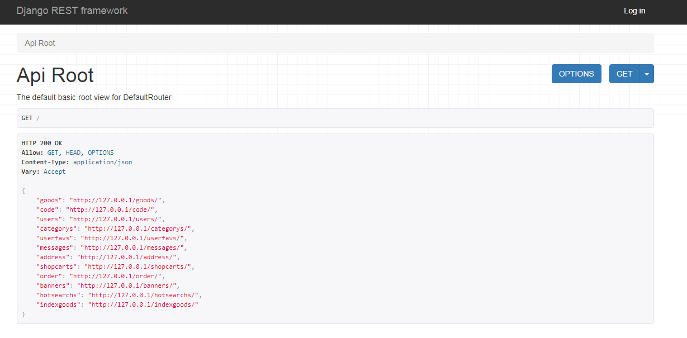
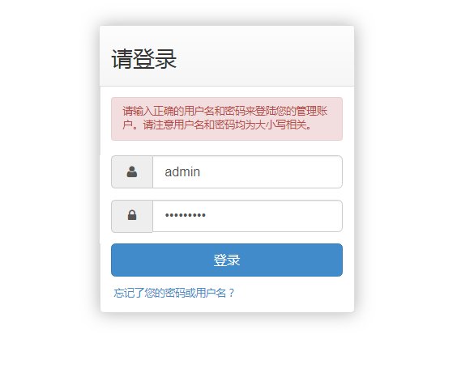

### 项目说明
项目是Vue + DjangoRESTframework搭建的电子商务网站

项目完成度：95%

项目环境：python3.6+django==2.02+djangorestframework

### 项目结构

### 项目用途
用于购物

### 项目具体API设计

#### goods设计

#### code设计

#### user设计

#### categorys

#### userfavs

#### 等等

### 后台登录

### 文档生成

### 前端vue就不介绍了。对接接口进行数据渲染

参考资料：https://cloud.tencent.com/developer/article/1107397
